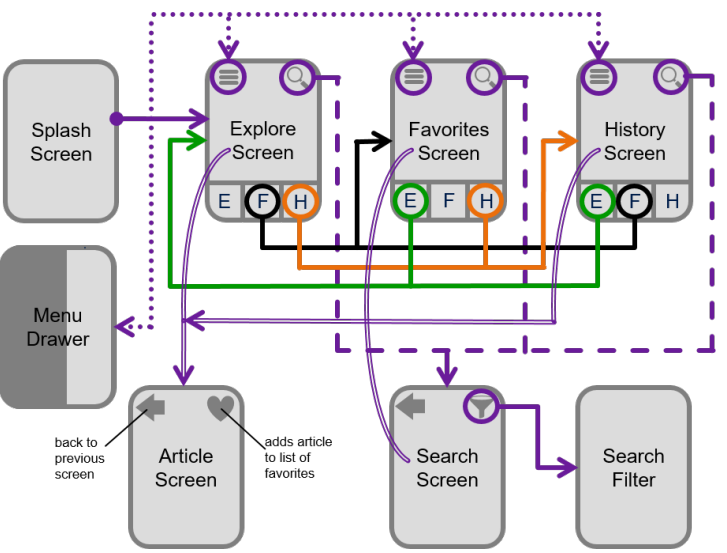

# Documentation

A **Splash Screen** forms the entry point of the app. It immediately routes to the **Explore**-screen.

The top row shows three primary screens: **Explore** (E), **Favorites** (F), and **History** (H).
Each of these screens has a top-left menu icon ("hamburger icon"), and a top-right search icon. 
From all three primary screens, a **Menu Drawer** can be accessed &mdash; it slides open from the left side.

The **Article Screen** contains the information (from the database). Actions available are:
  * Back to previous screen
  * Add to favorites (heart icon)

Last but not least, there is the **Search Screen**.

The conditional **Search Filter Screen** allows to adjusts search parameters. Once the filters are adjusted, the user is directed back to the **Search Screen**.
